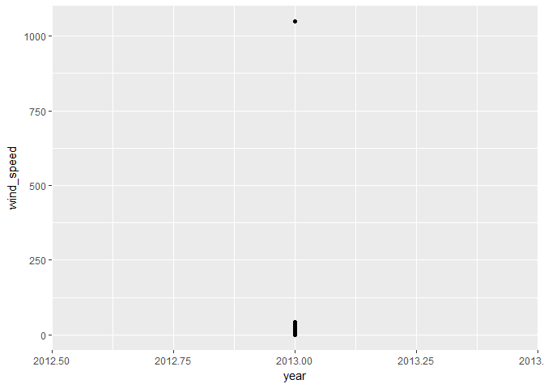
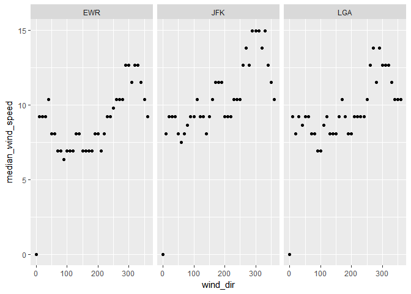
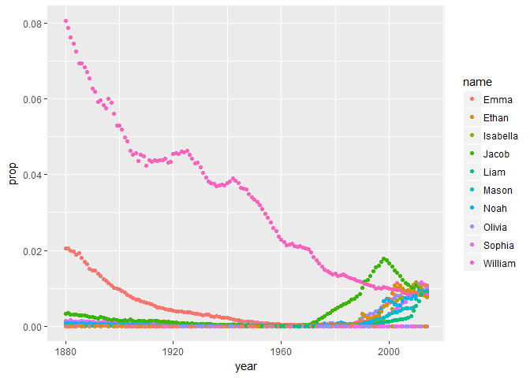

Task 7 New York City Flights and Weather
========================================

    library(nycflights13)
    library(tidyverse)

    ## Loading tidyverse: ggplot2
    ## Loading tidyverse: tibble
    ## Loading tidyverse: tidyr
    ## Loading tidyverse: readr
    ## Loading tidyverse: purrr
    ## Loading tidyverse: dplyr

    ## Conflicts with tidy packages ----------------------------------------------

    ## filter(): dplyr, stats
    ## lag():    dplyr, stats

    #Table of weather for nycflights dataset
    nycflights13::weather

    ## # A tibble: 26,130 × 15
    ##    origin  year month   day  hour  temp  dewp humid wind_dir wind_speed
    ##     <chr> <dbl> <dbl> <int> <int> <dbl> <dbl> <dbl>    <dbl>      <dbl>
    ## 1     EWR  2013     1     1     0 37.04 21.92 53.97      230   10.35702
    ## 2     EWR  2013     1     1     1 37.04 21.92 53.97      230   13.80936
    ## 3     EWR  2013     1     1     2 37.94 21.92 52.09      230   12.65858
    ## 4     EWR  2013     1     1     3 37.94 23.00 54.51      230   13.80936
    ## 5     EWR  2013     1     1     4 37.94 24.08 57.04      240   14.96014
    ## 6     EWR  2013     1     1     6 39.02 26.06 59.37      270   10.35702
    ## 7     EWR  2013     1     1     7 39.02 26.96 61.63      250    8.05546
    ## 8     EWR  2013     1     1     8 39.02 28.04 64.43      240   11.50780
    ## 9     EWR  2013     1     1     9 39.92 28.04 62.21      250   12.65858
    ## 10    EWR  2013     1     1    10 39.02 28.04 64.43      260   12.65858
    ## # ... with 26,120 more rows, and 5 more variables: wind_gust <dbl>,
    ## #   precip <dbl>, pressure <dbl>, visib <dbl>, time_hour <dttm>

    #Plot of year vs wind_speed to find outlier
    nycflights13::weather %>%
      ggplot(aes(year,wind_speed)) +
      geom_point()

    ## Warning: Removed 3 rows containing missing values (geom_point).

    #Filters wind speed for every number under 250 to get rid of outlier
    nycflights13::weather %>%
      filter(wind_speed <250)

    ## # A tibble: 26,126 × 15
    ##    origin  year month   day  hour  temp  dewp humid wind_dir wind_speed
    ##     <chr> <dbl> <dbl> <int> <int> <dbl> <dbl> <dbl>    <dbl>      <dbl>
    ## 1     EWR  2013     1     1     0 37.04 21.92 53.97      230   10.35702
    ## 2     EWR  2013     1     1     1 37.04 21.92 53.97      230   13.80936
    ## 3     EWR  2013     1     1     2 37.94 21.92 52.09      230   12.65858
    ## 4     EWR  2013     1     1     3 37.94 23.00 54.51      230   13.80936
    ## 5     EWR  2013     1     1     4 37.94 24.08 57.04      240   14.96014
    ## 6     EWR  2013     1     1     6 39.02 26.06 59.37      270   10.35702
    ## 7     EWR  2013     1     1     7 39.02 26.96 61.63      250    8.05546
    ## 8     EWR  2013     1     1     8 39.02 28.04 64.43      240   11.50780
    ## 9     EWR  2013     1     1     9 39.92 28.04 62.21      250   12.65858
    ## 10    EWR  2013     1     1    10 39.02 28.04 64.43      260   12.65858
    ## # ... with 26,116 more rows, and 5 more variables: wind_gust <dbl>,
    ## #   precip <dbl>, pressure <dbl>, visib <dbl>, time_hour <dttm>

    #Add the median of speed variable to table
    nycflights13::airports

    ## # A tibble: 1,458 × 8
    ##      faa                           name      lat        lon   alt    tz
    ##    <chr>                          <chr>    <dbl>      <dbl> <int> <dbl>
    ## 1    04G              Lansdowne Airport 41.13047  -80.61958  1044    -5
    ## 2    06A  Moton Field Municipal Airport 32.46057  -85.68003   264    -6
    ## 3    06C            Schaumburg Regional 41.98934  -88.10124   801    -6
    ## 4    06N                Randall Airport 41.43191  -74.39156   523    -5
    ## 5    09J          Jekyll Island Airport 31.07447  -81.42778    11    -5
    ## 6    0A9 Elizabethton Municipal Airport 36.37122  -82.17342  1593    -5
    ## 7    0G6        Williams County Airport 41.46731  -84.50678   730    -5
    ## 8    0G7  Finger Lakes Regional Airport 42.88356  -76.78123   492    -5
    ## 9    0P2   Shoestring Aviation Airfield 39.79482  -76.64719  1000    -5
    ## 10   0S9          Jefferson County Intl 48.05381 -122.81064   108    -8
    ## # ... with 1,448 more rows, and 2 more variables: dst <chr>, tzone <chr>

    #Add new column with median values for each airport
    m_wspd <- nycflights13::weather %>%
      mutate(median_wspeed = median(wind_speed, na.rm = FALSE))

    #Median wind speed for each airport
    my_df <- nycflights13::weather %>%
      filter(wind_speed <250) %>%
      group_by(origin, wind_dir) %>%
      summarise(median_wind_speed = median(wind_speed, na.rm = TRUE))

    #plot of wind_dir and median_wind_speed
    ggplot(my_df, aes(x = wind_dir, y = median_wind_speed)) +
      geom_point() +
      facet_wrap(~origin)

    ## Warning: Removed 3 rows containing missing values (geom_point).

    #select to view columns involving origin, wind speed, and median wind speed
    #nycflights13::weather %>%
    #  select(origin, wind_speed, median_wspeed)

    #Make table with columns for airline name and median distance flown from JFK
    median_dist_JFK <- nycflights13::flights %>%
      inner_join(airlines) %>%
      select(name, origin, distance) %>%
      filter(origin == "JFK") %>%
      group_by(name) %>%
      arrange(desc(distance)) %>%
      summarise(median_dist_JFK = median(distance))

    ## Joining, by = "carrier"

    #Make wide-format data frame displaying # of flights leaving EWR each month
    #from each airline
    EWR <- nycflights13::flights %>%
      filter(origin == "EWR") %>%
      left_join(airlines) %>%
      select(origin, month, name) %>%
      group_by(name, month) %>%
      summarise(Flights = n()) %>%
      spread(month, Flights, fill = NA, convert = FALSE, drop = TRUE, sep = NULL) %>%
      print()

    ## Joining, by = "carrier"

    ## Source: local data frame [12 x 13]
    ## Groups: name [12]
    ## 
    ##                        name   `1`   `2`   `3`   `4`   `5`   `6`   `7`
    ## *                     <chr> <int> <int> <int> <int> <int> <int> <int>
    ## 1      Alaska Airlines Inc.    62    56    62    60    62    60    62
    ## 2    American Airlines Inc.   298   268   295   288   297   291   303
    ## 3      Delta Air Lines Inc.   279   249   319   364   377   347   340
    ## 4         Endeavor Air Inc.    82    75    91    88   103    88    94
    ## 5                 Envoy Air   212   196   228   220   226   218   228
    ## 6  ExpressJet Airlines Inc.  3838  3480  3996  3870  4039  3661  3747
    ## 7           JetBlue Airways   573   532   612   567   517   506   546
    ## 8     SkyWest Airlines Inc.    NA    NA    NA    NA    NA     2    NA
    ## 9    Southwest Airlines Co.   529   490   532   518   530   501   526
    ## 10    United Air Lines Inc.  3657  3433  3913  4025  3874  3931  4046
    ## 11          US Airways Inc.   363   328   372   361   381   390   402
    ## 12           Virgin America    NA    NA    NA   170   186   180   181
    ## # ... with 5 more variables: `8` <int>, `9` <int>, `10` <int>, `11` <int>,
    ## #   `12` <int>

Baby Names
==========

    # Ten most common male and female names in 2014. 
    babynames <- babynames::babynames %>%
      arrange(desc(n)) %>%
      filter(year == "2014") %>%
      slice(1:10) %>%
      print()

    ## # A tibble: 10 × 5
    ##     year   sex     name     n        prop
    ##    <dbl> <chr>    <chr> <int>       <dbl>
    ## 1   2014     F     Emma 20799 0.010729242
    ## 2   2014     F   Olivia 19674 0.010148906
    ## 3   2014     M     Noah 19144 0.009431494
    ## 4   2014     F   Sophia 18490 0.009538136
    ## 5   2014     M     Liam 18342 0.009036381
    ## 6   2014     M    Mason 17092 0.008420555
    ## 7   2014     F Isabella 16950 0.008743721
    ## 8   2014     M    Jacob 16712 0.008233344
    ## 9   2014     M  William 16687 0.008221027
    ## 10  2014     M    Ethan 15619 0.007694866

    #Plot frequency of top ten 2014 babynames since 1880.
    babynames::babynames %>%
      filter(year > 1879, name == "Emma" | name == "Olivia" | name == "Noah" | name == "Sophia" | name == "Liam" | name == "Mason" | name == "Isabella" | name == "Jacob" |  name == "William" | name == "Ethan") %>%
      ggplot(mapping = aes(x = year, y = prop, colour = name)) +
      geom_point()

    #Table 26-29th most common girls names in 1896, 1942, and 2016
    babynames::babynames %>%
      filter(sex == "F", year == "1896"| year == "1942"| year == "2016") %>%
      arrange(desc(prop)) %>%
      slice(26:29) %>%
      print()

    ## # A tibble: 4 × 5
    ##    year   sex    name     n       prop
    ##   <dbl> <chr>   <chr> <int>      <dbl>
    ## 1  1942     F   Karen 15388 0.01106783
    ## 2  1942     F Dorothy 15031 0.01081106
    ## 3  1896     F Lillian  2702 0.01072243
    ## 4  1896     F   Alice  2652 0.01052402

My own task:
============

My task is to use fueleconomy dataset and from this isolate the top 100
compact and midsize cars and make a table comparing the year, class, and
model in order of most recent year

    fueleconomy <- fueleconomy::vehicles %>%
      arrange(desc(year)) %>%
      select(class, model, year) %>%
      filter(class == "Compact Cars" | class == "Midsize Cars") %>%
      slice(1:100) %>%
      print()

    ## # A tibble: 100 × 3
    ##           class                  model  year
    ##           <chr>                  <chr> <int>
    ## 1  Midsize Cars                     A8  2015
    ## 2  Midsize Cars                     A8  2015
    ## 3  Midsize Cars                     S8  2015
    ## 4  Compact Cars        428i Gran Coupe  2015
    ## 5  Compact Cars        435i Gran Coupe  2015
    ## 6  Midsize Cars                   528i  2015
    ## 7  Compact Cars        640i Gran Coupe  2015
    ## 8  Compact Cars 640i xDrive Gran Coupe  2015
    ## 9  Compact Cars        650i Gran Coupe  2015
    ## 10 Compact Cars 650i xDrive Gran Coupe  2015
    ## # ... with 90 more rows
