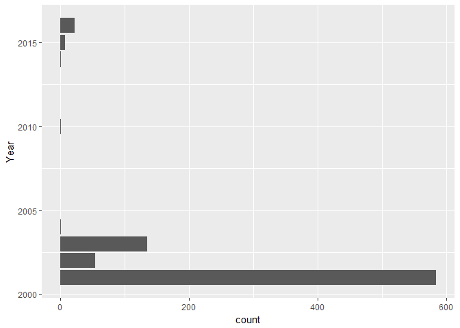
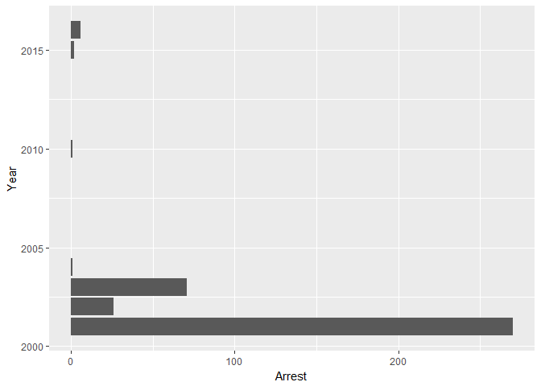

Introduction
============

The importance of being aware of **crime statistics** over the past
several years is important in regards to future crime statistics. By
understanding where we have been we can look for alternatives that will
aid in figuring out the future. The importance of knowing crime rates
will help in three ways:

------------------------------------------------------------------------

1.  Be Aware
2.  Use Media Attention
3.  Reduction

------------------------------------------------------------------------

In order to reduce crime rates in Chicago, first we need to change our
outlook on the situation at hand. Being aware and knowledgable of your
neighborhood and the people who live around you will allow you to take
control of the situation. Making crime data available for public viewing
puts the public eye right on the issue at hand. This will allow people
to see where they are living and want to fix up their neighborhoods.
Finally all of this will allow the reduction of crime.

Results
=======

The barplot shows the difference between the number of criminal cases
each year in Chicago between 2001 and 2015. Naturally most of the data
has been deleted, as my 6 year old laptop kept crashing due to the
abundantly sized dataset which was too large to download.

    library(tidyverse)

    ## Loading tidyverse: ggplot2
    ## Loading tidyverse: tibble
    ## Loading tidyverse: tidyr
    ## Loading tidyverse: readr
    ## Loading tidyverse: purrr
    ## Loading tidyverse: dplyr

    ## Conflicts with tidy packages ----------------------------------------------

    ## filter(): dplyr, stats
    ## lag():    dplyr, stats

    library(readxl)
    crimes <- read_excel("Crimes_2001_to_present.xlsx")
    ggplot(crimes, aes(x=Year)) + 
      geom_bar() +
      coord_flip()

The barplot shows the difference between the number of criminal cases
that led to an arrest each year in Chicago between 2001 and 2015.

    ggplot(data = crimes) + 
      geom_bar(mapping = aes(x = Year, y = Arrest), stat = "identity")+
      coord_flip()

Due to the nature of raw data and the impact that it has, a small
portion of the dataset will be available for viewing below.

    head(crimes)

    ## # A tibble: 6 × 3
    ##                Type Arrest  Year
    ##               <chr>  <dbl> <dbl>
    ## 1           BATTERY      0  2001
    ## 2 CRIMINAL TRESPASS      1  2003
    ## 3         NARCOTICS      1  2003
    ## 4         NARCOTICS      1  2001
    ## 5           ASSAULT      0  2001
    ## 6             THEFT      1  2001

Discussion
==========

Crime has decreased significantly since 2001 and we are on the right
track for getting rid of crime in the city of Chicago.
